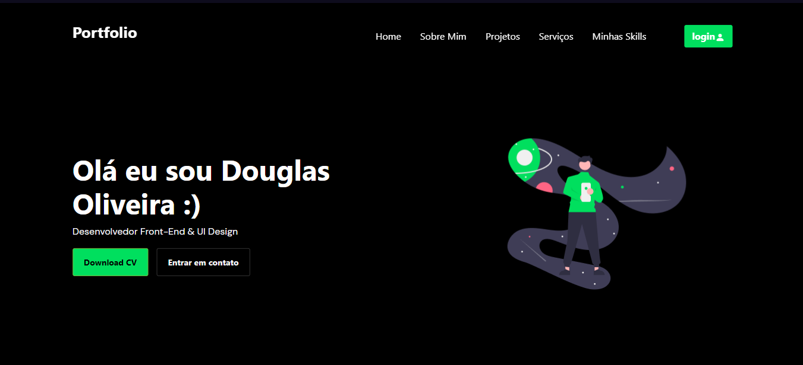

<h1 align="center">Desafio 9👋</h1>
<p>
  <a href="#" target="_blank">
    
  </a>
</p>

> Desafio 9 da codelandia do Iuri Silva finalizado e como de costume sempre tendo trazer algo a mais do que foi pedido no desafio dessa vez além do layout implementei um sistema de busca ultilizando a api do github ele fazer uma verificação trazendo as informações basica do seu perfil do github bem simples decidir implementar esse sistema para complementar meus estudo de python na web usando Flask e jinja2 

Veja o projeto final aqui:(https://desafio9.herokuapp.com)

## Run tests

```sh
pip install -r requirements.txt
```
depois de instalado as dependencias 

```sh
python app.py
```

## Author

👤 **JEFF (Douglas)**

* Website: http://douglasportifolio.tk/
* Github: [@jeffbeu](https://github.com/jeffbeu)
* LinkedIn: [@https:\/\/www.linkedin.com\/in\/douglas-oliveira-305961160\/](https://linkedin.com/in/https:\/\/www.linkedin.com\/in\/douglas-oliveira-305961160\/)

## Show your support

Give a ⭐️ if this project helped you!

***
_This README was generated with ❤️ by [readme-md-generator](https://github.com/kefranabg/readme-md-generator)_
